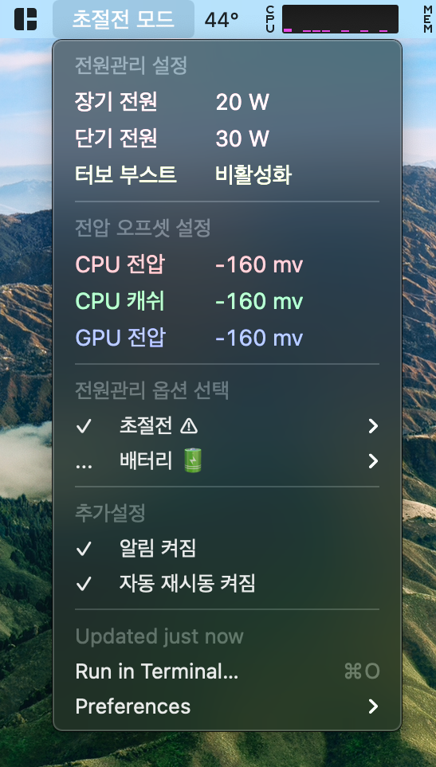

# SmartCPU For XPS15 9570 I7

맥OS 전원 관리 스크립트

> 배터리 상태에 따라 CPU 전원을 자동으로 조정합니다

## 주의사항

- 이 스크립트는 패닉을 일으킬수 있으며 설정에 따라 CPU를 손상시킬수 있습니다.
- 시스템이 불안정하다면 SmartCPU를 제거하고 재설치 후에 더 나은 설정값을 찾으십시오.

# 기능

- 전원 어댑터 연결/연결해제를 감지하여 자동으로 프로필을 변경합니다.
- 배터리 수치가 낮을때 프로필을 변경합니다. (기본값 : 20%)
- 배터리 수치가 치명적으로 낮을때 자동으로 시스템을 종료시킵니다 (기본값 : 5%)
- 상태 UI는 [Bitbar](https://github.com/matryer/bitbar) 기반으로 만들어졌습니다.
- 이 스크립트는 아래의 CPU 설정값을 조절합니다.
  - 장기 전원
  - 단기 전원
  - 터보부스트 활성화/비활성화
  - 언더볼팅 값
- 기본 설정파일에 5가지 값이 포함되어있습니다. (기본 설정파일은 I7-8750H에 맞게 설정되어있습니다.)
  - 배터리 모드의 2가지 프로필
  - 어댑터 모드의 3가지 프로필
- 언더볼팅은 [@sicreative](https://github.com/sicreative/VoltageShift)의 VoltageShift kext에 기반을 둠.
- 프로필이 변경되었을때 알림.



# 설치방법

- 소스코드를 다운받습니다
- `config.sh` 파일의 값을 자신의 CPU에 맞게 수정합니다
- `bash try.sh` 명령어를 통해 앞서 설정한 설정값을 테스트합니다.
- Cinebench나 Geekbench를 통해 안정성을 확인합니다.
- 시스템이 충분히 안정적일떄 `bash install.sh` 를 통해 시스템과 같이 실행되도록 합니다.
- [링크](https://github.com/matryer/bitbar) 에서 `Bitbar` 를 설치합니다.
- 이 리포지토리의`plugin` 폴더를 Bitbar의 플러그인 폴더로 선택해주세요.
- SmartCPU를 삭제하기위해서는 `bash uninstall.sh` 를 사용하세요.

### DELL XPS15 9570 I7을 위한 `config.sh` 예시

```bash
######### BEGIN OF YOUR CONFIG #########
# All power value should be below your CPU TPD, you can not overclock cpu with this value

# EXTRA BATTERY PROFILE 0               <EXTRA LOW BATTERY USAGE>
EX_BATTERY_LONG="10"         # Long period power usage of cpu W
EX_BATTERY_SHORT="15"        # Short period power usage of cpu W
EX_BATTERY_TURBO="0"        # Intel turbo on/off <Off>
# BATTERY USAGE PROFILE 1               <LOW BATTARY USAGE AND COOL>
BATTERY_LONG="20"            # Long period power usage of cpu W
BATTERY_SHORT="25"          # Short period power usage of cpu W
BATTERY_TURBO="1"           # Intel turbo on/off <Off>
# NORMAL USAGE PROFILE 2                <SMOOTHEST AND COOL>
NORMAL_LONG="25"
NORMAL_SHORT="30"
NORMAL_TURBO="1"
# PERFORMANCE USAGE PROFILE 3           <PERFORMANCE COOL>
PERFORMANCE_LONG="35"
PERFORMANCE_SHORT="40"
PERFORMANCE_TURBO="1"
# EXTRA PERFORMANCE USAGE PROFILE 4     <PERFORMANCE MAX>
EX_PERFORMANCE_LONG="45"
EX_PERFORMANCE_SHORT="60"
EX_PERFORMANCE_TURBO="1"
# SETTING AUTO PROFILE ON BATTERY LOW
BATTERY_LOW_PERCENT=20      # Setting percent when battery is low
BATTERY_LOW_PROFILES=0      # When battery low will setting this profile
# SETTING INIT PROFILE
BATTERY_PROFILE=1           # On battery will select this profile
PLUGIN_PROFILE=3            # On plugin adapter will select this profile
# UNDERVOLT
# Setting to undervolt CPU -> Colddown (mha)
# Config this must carefully, can damage your cpu ( set to 0 if you want to bypass )
CPU_VOLT="-160"
GPU_VOLT="-85"
CPU_CACHE_VOLT="-160"
######### END OF CONFIG #########
```

# Thanks

    @sicreative VoltageShift Kext
    @tctien342 SmartCPU
